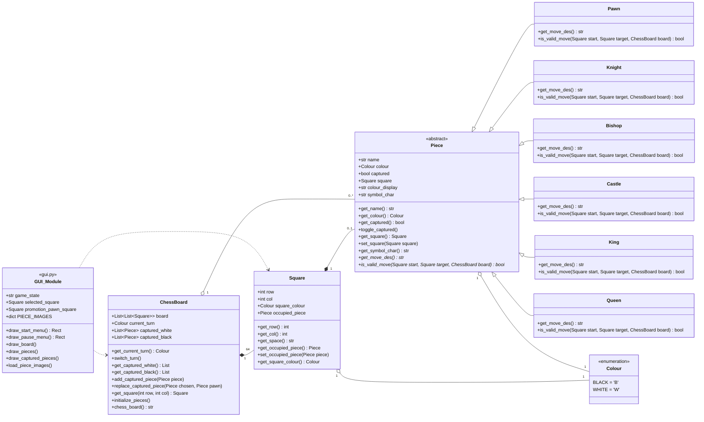

```mermaid
classDiagram
    direction LR
    %% Core Enums & Abstract Base Classes
    class Colour {
        <<enumeration>>
        BLACK = 'B'
        WHITE = 'W'
    }

    class Piece {
        <<abstract>>
        +str name
        +Colour colour
        +bool captured
        +Square square
        +str colour_display
        +str symbol_char
        +get_name() str
        +get_colour() Colour
        +get_captured() bool
        +toggle_captured()
        +get_square() Square
        +set_square(Square square)
        +get_symbol_char() str
        +get_move_des()* str
        +is_valid_move(Square start, Square target, ChessBoard board)* bool
    }

    %% Concrete Piece Classes
    class Pawn {
        +get_move_des() str
        +is_valid_move(Square start, Square target, ChessBoard board) bool
    }

    class Knight {
        +get_move_des() str
        +is_valid_move(Square start, Square target, ChessBoard board) bool
    }

    class Bishop {
        +get_move_des() str
        +is_valid_move(Square start, Square target, ChessBoard board) bool
    }

    class Castle {
        +get_move_des() str
        +is_valid_move(Square start, Square target, ChessBoard board) bool
    }

    class King {
        +get_move_des() str
        +is_valid_move(Square start, Square target, ChessBoard board) bool
    }

    class Queen {
        +get_move_des() str
        +is_valid_move(Square start, Square target, ChessBoard board) bool
    }

    %% Inheritance Relationships
    Piece <|-- Pawn
    Piece <|-- Knight
    Piece <|-- Bishop
    Piece <|-- Castle
    Piece <|-- King
    Piece <|-- Queen

    %% Domain Objects
    class Square {
        +int row
        +int col
        +Colour square_colour
        +Piece occupied_piece
        +get_row() int
        +get_col() int
        +get_space() str
        +get_occupied_piece() Piece
        +set_occupied_piece(Piece piece)
        +get_square_colour() Colour
    }

    class ChessBoard {
        +List~List~Square~~ board
        +Colour current_turn
        +List~Piece~ captured_white
        +List~Piece~ captured_black
        +get_current_turn() Colour
        +switch_turn()
        +get_captured_white() List
        +get_captured_black() List
        +add_captured_piece(Piece piece)
        +replace_captured_piece(Piece chosen, Piece pawn)
        +get_square(int row, int col) Square
        +initialize_pieces()
        +chess_board() str
    }

    %% Presentation / GUI Loop
    class GUI_Module {
        <<gui.py>>
        +str game_state
        +Square selected_square
        +Square promotion_pawn_square
        +dict PIECE_IMAGES
        +draw_start_menu() Rect
        +draw_pause_menu() Rect
        +draw_board()
        +draw_pieces()
        +draw_captured_pieces()
        +load_piece_images()
    }

    %% Object Associations & Dependencies
    Square "1" *-- "0..1" Piece 
    Square "1" o-- "1" Colour 
    Piece "1" o-- "1" Colour 
    ChessBoard "1" *-- "64" Square 
    ChessBoard "1" o-- "0..*" Piece 
    GUI_Module ..> ChessBoard 
    GUI_Module ..> Square 
```